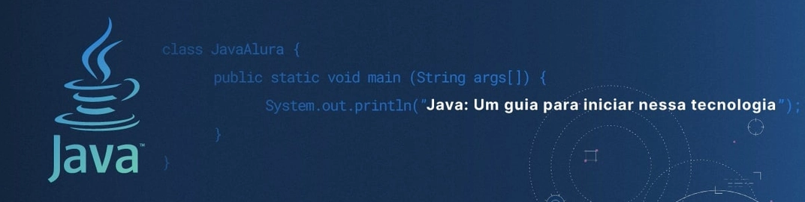

# ☕ Java Developer Roadmap & Knowledge Hub

Welcome to the **Java Developer Roadmap & Knowledge Hub**. This repository is designed as a continuous learning path—from core language fundamentals to enterprise software architecture, cloud integration, and algorithmic problem-solving. 

Whether you are building foundational skills or designing highly scalable, cloud-native systems, this hub provides curated notes, code examples, and real-world study scenarios.

---

## 🗺️ Learning Roadmap

*   **[Phase 1: Core Java & Object-Oriented Programming](#phase-1---core-java--oop)**
*   **[Phase 2: Generics & Collections Framework](#phase-2---generics--collections)**
*   **[Phase 3: I/O, Serialization & Networking](#phase-3---io-serialization--networking)**
*   **[Phase 4: Concurrency & Multithreading](#phase-4---concurrency--multithreading)**
*   **[Phase 5: Software Design & Architecture](#phase-5---software-design--architecture)**
*   **[Phase 6: Data Structures & Algorithms](#phase-6---data-structures--algorithms)**
*   **[Phase 7: Enterprise Ecosystem (Spring Boot & AWS)](#phase-7---enterprise-ecosystem-spring-boot--aws-new)**
*   **[Phase 8: DevOps & CI/CD Pipelines](#phase-8---devops--cicd-new)**

---

## 🏗️ Phase 1 - Core Java & OOP
Mastering the building blocks of Java and the principles of Object-Oriented Programming.

### 📚 Fundamentals
*   [Java Keywords, Definitions & Examples](learning_java/java_keywords)
*   [Execution Process & JVM Internals](learning_java/java_how_it_works)
*   [Data Types, Variables & Operators](code_java/java_basicsI_and_oops/variables_and_operators)
*   [Control Flow & Conditional Statements](code_java/java_basicsI_and_oops/control_flow)
*   [Arrays & Memory Allocation](code_java/java_basicsI_and_oops/arrays)

### 🧩 Object-Oriented Programming (OOP)
*   [Classes, Objects & Inner Classes](code_java/java_basicsI_and_oops/class_and_object)
*   [The `static` and `this` Keywords](code_java/java_basicsI_and_oops/static_and_this)
*   [Inheritance (is-a) & Association (has-a)](code_java/java_basicsI_and_oops/inheritance)
*   [Encapsulation & Access Modifiers](code_java/java_basicsI_and_oops/encapsulation)
*   [Polymorphism: Overloading vs Overriding](code_java/java_basicsI_and_oops/runtime_polymorphism)
*   [Abstraction & Interfaces](code_java/java_basicsI_and_oops/abstraction)
*   [The `super`, `final`, and `instanceof` Keywords](code_java/java_basicsI_and_oops/super_and_final)

### 🛠️ Core Utilities
*   [String Manipulation & Immutability](code_java/java_basicsI_and_oops/strings)
*   [Errors & Exception Handling Strategies](learning_java/java_exceptions)
*   [Date & Time API (java.time)](code_java/java_basicsI_and_oops/date_time)

---

## 🗄️ Phase 2 - Generics & Collections
Handling data dynamically and safely using the Java Collections Framework.

*   **Concepts:** [Understanding Java Generics](learning_java/java_generics) | [Collections Framework Overview](learning_java/java_collections)
*   **The Collection Interface:** [List, Set, Queue implementations](code_java/java_basicsII_and_collections/collection_interface)
*   **The Map Interface:** [HashMap, TreeMap, ConcurrentHashMap](code_java/java_basicsII_and_collections/map_interface)
*   **Utilities:** [The Collections Utility Class](code_java/java_basicsII_and_collections/collections_class)
*   **Legacy Data Structures:** [Vector, Stack, Enum](code_java/java_basicsII_and_collections/legacy_ds)

---

## 🔌 Phase 3 - I/O, Serialization & Networking
Interacting with the outside world: file systems, data streams, and network sockets.

*   [File Handling & I/O Streams](code_java/java_io_networking/input_output)
*   [Object Serialization & Deserialization](code_java/java_io_networking/serialization)
*   [Networking: Sockets, URLs, HTTP, Datagrams](code_java/java_io_networking/networking)
*   [Lambda Expressions & Functional Interfaces](code_java/java_misc_advanced_concepts/lambda)
*   [Regular Expressions (RegEx)](code_java/java_misc_advanced_concepts/regex)

---

## ⚡ Phase 4 - Concurrency & Multithreading
Building high-performance, asynchronous, and thread-safe applications.

*   **Concepts:** [Multithreading & Garbage Collection](learning_java/java_multithreading) | [Thread Synchronization](learning_java/java_thread_synchronization)
*   **Implementation:** [Creating and Managing Threads](code_java/java_concurrency/multithreading)
*   **Safety:** [Synchronization & Locks](code_java/java_concurrency/synchronization)
*   **Patterns:** [Classic Concurrency Problems (Producer-Consumer, Dining Philosophers)](code_java/java_concurrency/classic_problems)

---

## 📐 Phase 5 - Software Design & Architecture
Moving from writing code to engineering systems. Focus on maintainability, decoupling, and best practices.

*   **Design Principles:**
    *   [SOLID Principles Explained & Applied](_notes_others/solid)
    *   [Clean Architecture in Java](_notes_others/clean_architecture)
*   **GoF Design Patterns:**
    *   [Creational Patterns (Singleton, Builder, Factory, Prototype)](code_java/java_design_patterns/gof_creational)
    *   [Structural Patterns (Adapter, Decorator, Facade)](code_java/java_design_patterns/gof_structural)
    *   [Behavioral Patterns (Observer, Strategy, Command)](code_java/java_design_patterns/gof_behavioral)

---

## 🧠 Phase 6 - Data Structures & Algorithms
Applied computer science for optimal problem solving. **All algorithmic challenges in this section are paired with real-world study case scenarios.**

*   **Theory & Cheatsheets:** [Big O Notation](_notes_others/bigO) | [Dynamic Programming Concepts](_notes_others/dp) | [LeetCode DSA Patterns](_notes_others/leetcode_dsa_patterns)
*   **Linear Data Structures:** [Arrays](code_java/java_datastructures_algorithms/arrays) | [Linked Lists](code_java/java_datastructures_algorithms/linked_lists) | [Stacks](code_java/java_datastructures_algorithms/stacks) | [Queues](code_java/java_datastructures_algorithms/queues)
*   **Non-Linear Data Structures:** [BSTs](code_java/java_datastructures_algorithms/bst) | [Heaps](code_java/java_datastructures_algorithms/heap) | [Hashing](code_java/java_datastructures_algorithms/hashing)
*   **Algorithms:**
    *   [Searching & Sorting](code_java/java_datastructures_algorithms/sorting)
    *   [Tree & Graph Traversal (DFS/BFS)](code_java/java_datastructures_algorithms/tree_traversal)
    *   [Classic Graph Algorithms (Dijkstra, Prim, Kruskal)](code_java/java_datastructures_algorithms/graph_classic_algos)
    *   [Dynamic Programming Solutions](code_java/java_datastructures_algorithms/dynamic_programming)

---

## 🚀 Phase 7 - Enterprise Ecosystem (Spring Boot & AWS) [NEW]
Modernizing Java for the cloud. Bridging core Java with enterprise-grade frameworks and cloud-native architecture.

*   **Spring Boot:** Dependency Injection, Spring Security, RESTful APIs, and application properties.
*   **Cloud Native (AWS):** Integrating Java applications with AWS services (DynamoDB, S3, SQS).
*   **Serverless Java:** Building AWS Lambda functions using Java.

---

## ⚙️ Phase 8 - DevOps & CI/CD [NEW]
Automating the lifecycle of Java applications.

*   **GitHub Actions:** 
    *   Automated testing on `push` and `pull_request` events.
    *   Building and publishing Java artifacts (Maven/Gradle).
*   **Containerization:** Packaging Java apps with Docker for seamless deployment.

---

## 📚 Recommended Resources
* -->  [Essential Java & Computer Science Books](https://github.com/manjunath5496/Computer-Science-Reference-Books/tree/master)
* -->  [Great Websites & Communities for Learning](https://daily.dev/blog/best-websites-learn-programming-developer-guide/)

 

> *"Software architecture is the art of drawing lines that I call boundaries. Those boundaries separate software elements from one another, and restrict those on one side from knowing about those on the other." — Robert C. Martin*